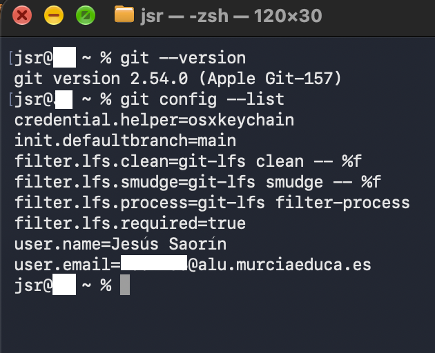
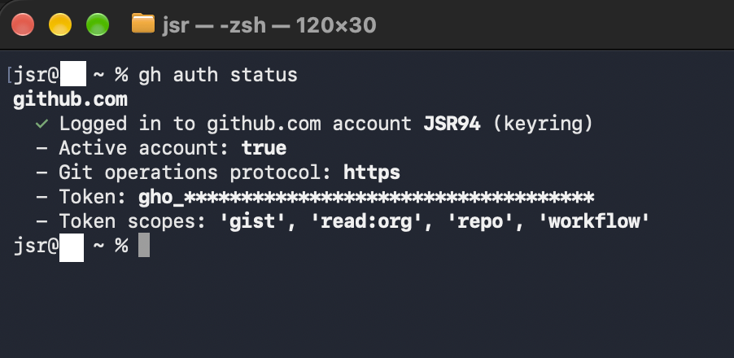
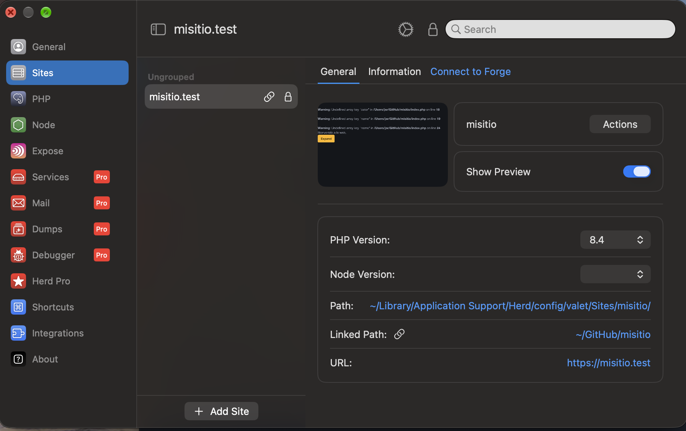
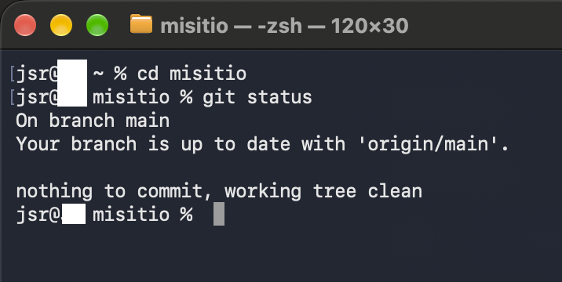
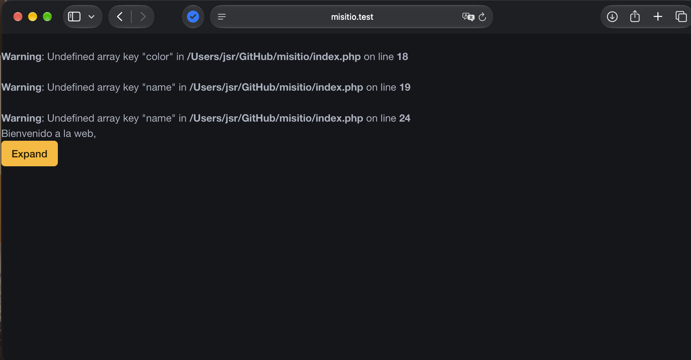
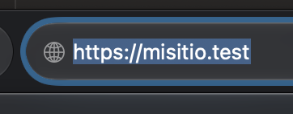

# Documentación de la instalación y configuración

## 1. Git instalado y configurado en local

En este apartado se muestra que Git está instalado y configurado correctamente
en el equipo local.

## 2. GitHub CLI instalado y configurado

Se comprueba que GitHub CLI está instalado y que la cuenta de GitHub está
correctamente autenticada.

## 3. Herd instalado con PHP 8.4

Se muestra Herd instalado y configurado utilizando PHP 8.4.

## 4. Repositorio `misitio` clonado en local

Se muestra el repositorio `misitio` descargado y disponible en el equipo
local.

## 5. Herd enlazado al repositorio `misitio` y servido mediante HTTPS

Finalmente, se muestra que Herd tiene enlazado el repositorio `misitio` y que
el sitio web está disponible mediante HTTPS.

